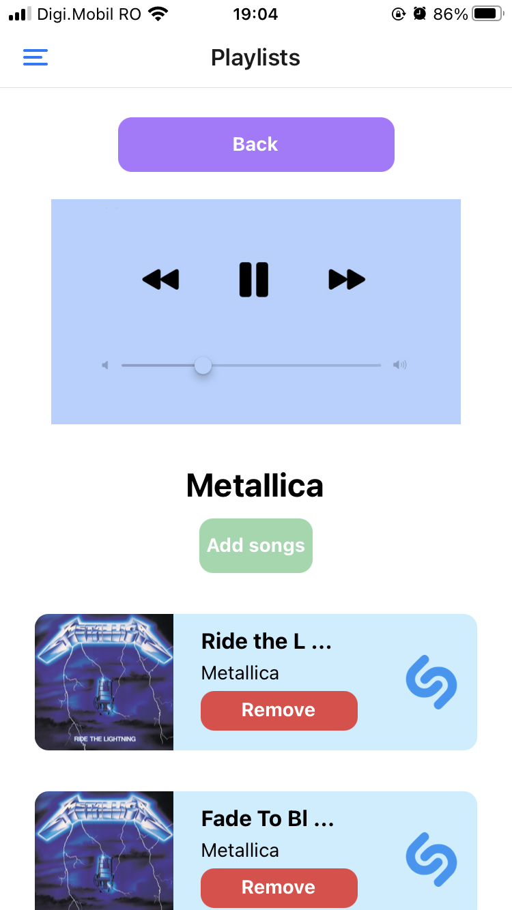

# UVT-GDSC-NestJS-Workshop

# Prerequisites
1. Install NodeJs: https://nodejs.org/
2. Install Postman: https://www.postman.com/
3. Install XAMPP: https://www.apachefriends.org/

# Setup
1. Install NestJs CLI: `npm i -g @nestjs/cli`
2. Run `nest new project-name` to create a new NestJs project
3. Change the directory to the new project and run `npm run start:dev` to start the NestJs server

# Session 1: Creating GET endpoints
## Hello World Module
1. Create an endpoint that returns a string "Hello World!".

## Math Module
1. Create an endpoint that subtracts two numbers.
2. Create an endpoint that sums two numbers.
3. Create an endpoint that multiplies two numbers.
4. Create an endpoint that divides two numbers.
5. Create an endpoint that given an operation and a string of numbers separated by `,`, returns the result of the operation applied to the numbers.

## Movie Module
1. Create an endpoint that returns a list of available movies (title and id).
2. Add query params to the endpoint from point 1 to sort the movies by title ascending or descending.
3. Create an endpoint that returns movie details given the movie id.

## Random Module
1. Create an endpoint that returns a random quote.
2. Create an endpoint that returns a random dog photo.

# Session 2: Creating CRUD endpoints connected to a database

# Before starting
1. Create a new NestJs application using `nest new session2`
2. Run `npm install --save @nestjs/typeorm typeorm mysql2`
3. Create a `ormconfig.ts` file at `./src` level with the following content:
```typescript
import { DataSourceOptions } from 'typeorm';

const config: DataSourceOptions = {
  type: 'mysql',
  host: 'localhost',
  port: 3306,
  username: 'root',
  password: '',
  database: '<<NAME OF THE DATABASE>>',
  entities: [__dirname + '/**/*.entity.{ts,js}'],
  synchronize: true,
};

export = config;
```
4. In `app.module.ts`, add `TypeOrmModule.forRoot(ormconfig)` to the `imports` array, with `import * as ormconfig from './ormconfig'` a an import.

## User Module
1. Create an endpoint that (c)reates a new user.
2. Create an endpoint that (r)eads and returns a user given the user id.
3. Create an endpoint that (u)pdates a user given the user id.
4. Create an endpoint that (d)eletes a user given the user id.

## Music Module
1. Create an endpoint that creates a song (title, artist, length ...).
2. Create an endpoint that creates a playlist (playlist name, songs).
3. Create an endpoint that updates a playlist with a given song.
4. Create an endpoint that removes a song from a playlist.
5. Create an endpoint that returns a list of available playlists.
6. Create an endpoint that returns a list of songs in a playlist.

# Final project

A song organizer that uses the endpoints from *session2*. 

<div style="flex-direction:row;">
    
    
</div>
<br>
<div style="flex-direction:row;">
    
    
</div>

Something to take in consideration is that if you want to test the app you need to forward your localhost by using **ngrok**. After installing you should run **ngrok http 3000** and copy the link in the **redirectLocalHost.js** file.